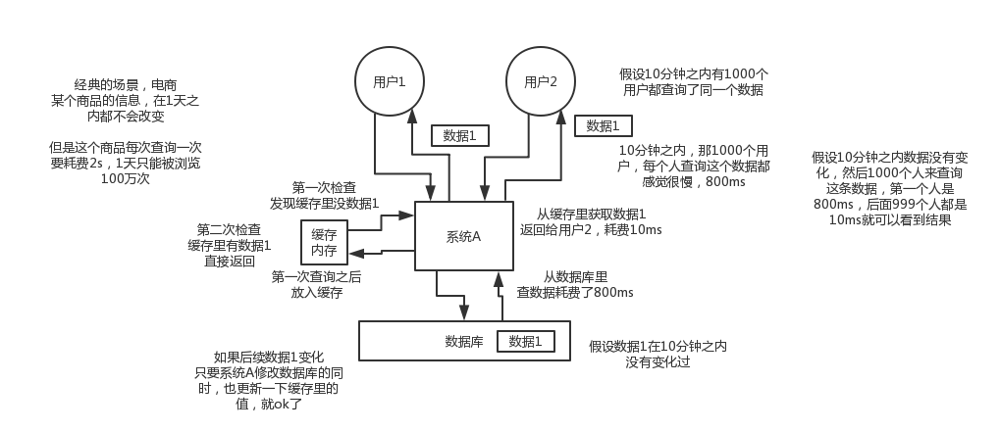
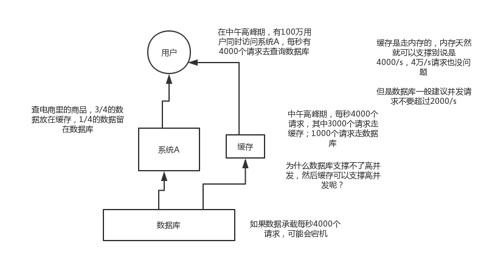
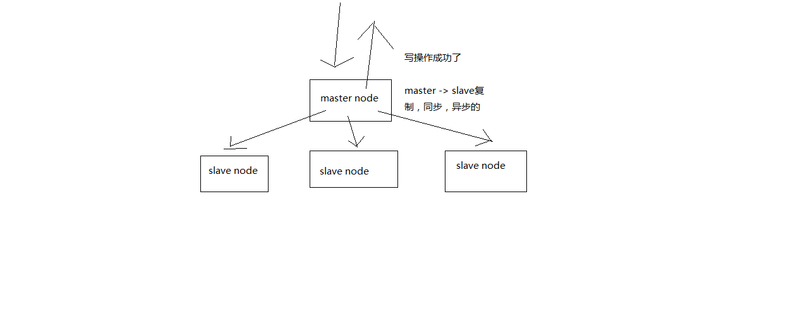
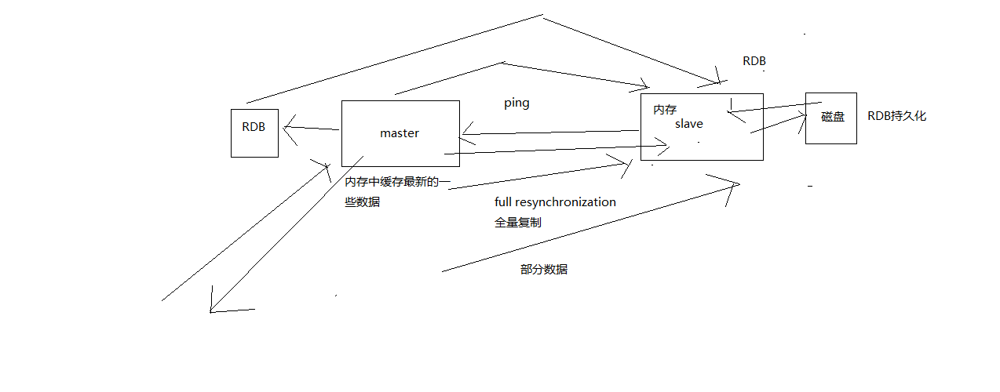
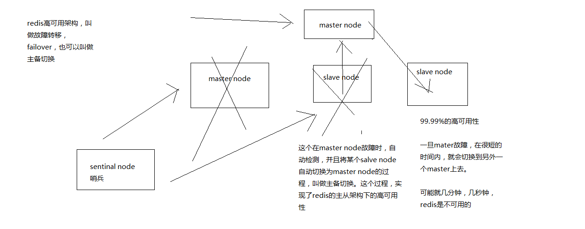
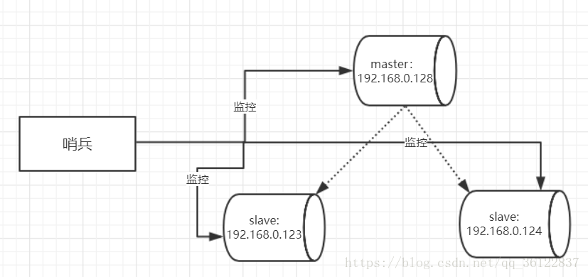
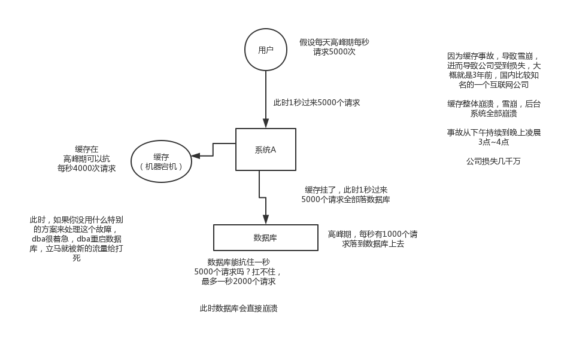
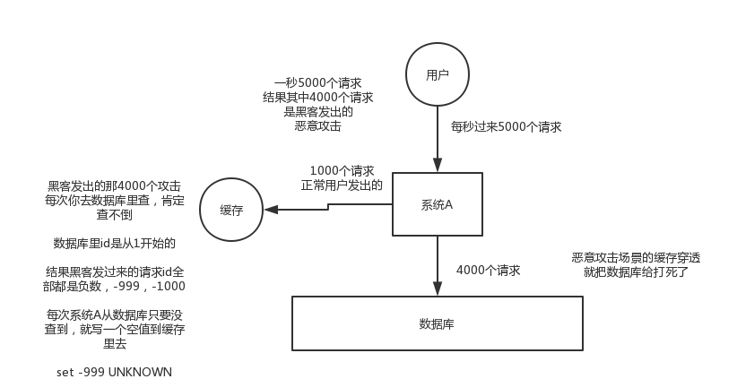
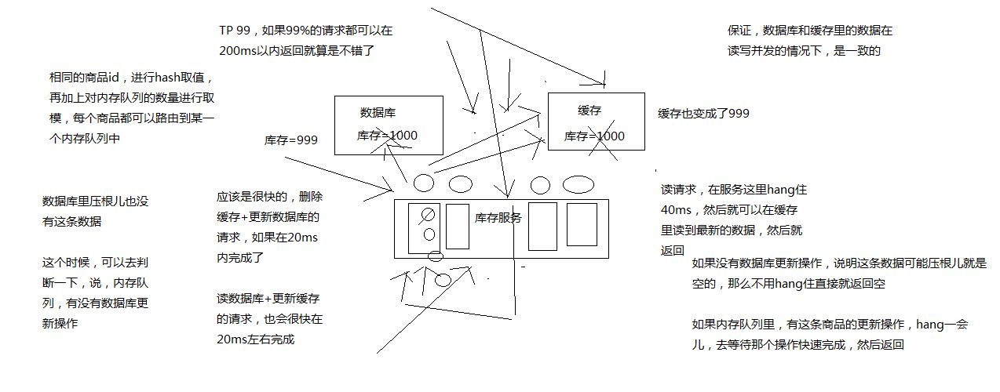

[TOC]


### 1.项目为什么要用缓存？
高性能和高并发
#### 缓存怎么实现高性能？



#### 缓存怎么实现高并发？


#### 缓存用了有什么不良后果？
1）缓存与数据库双写不一致
2）缓存雪崩
3）缓存穿透
4）缓存并发竞争
5）缓存击穿
6）热点数据数据集中失效问题


### 2.redis线程模型？
#### redis和memcached有什么区别？
1）Redis支持服务器端的数据操作：Redis相比Memcached来说，拥有更多的**数据结构和并支持更丰富**的数据操作，通常在Memcached里，你需要将数据拿到客户端来进行类似的修改再set回去。这大大增加了网络IO的次数和数据体积。在Redis中，这些复杂的操作通常和一般的GET/SET一样高效。所以，如果需要缓存能够支持更复杂的结构和操作，那么Redis会是不错的选择。

~~2）内存使用效率对比：使用简单的key-value存储的话，Memcached的内存利用率更高，而如果Redis采用hash结构来做key-value存储，由于其组合式的压缩，其内存利用率会高于Memcached。~~

~~3）性能对比：由于Redis只使用单核，而Memcached可以使用多核，所以平均每一个核上Redis在存储小数据时比Memcached性能更高。而在100k以上的数据中，Memcached性能要高于Redis，虽然Redis最近也在存储大数据的性能上进行优化，但是比起Memcached，还是稍有逊色。~~

4）**集群模式**：memcached没有原生的集群模式，需要依靠客户端来实现往集群中分片写入数据；但是redis目前是原生支持cluster模式的，redis官方就是支持redis cluster集群模式的，比memcached来说要更好

#### redis的线程模型是什么？


```
1）文件事件处理器
 redis基于reactor模式开发了网络事件处理器，这个处理器叫做文件事件处理器，file event handler。这个文件事件处理器，是单线程的，redis才叫做单线程的模型，采用IO多路复用机制同时监听多个socket，根据socket上的事件来选择对应的事件处理器来处理这个事件。

如果被监听的socket准备好执行accept、read、write、close等操作的时候，跟操作对应的文件事件就会产生，这个时候文件事件处理器就会调用之前关联好的事件处理器来处理这个事件。

文件事件处理器是单线程模式运行的，但是通过IO多路复用机制监听多个socket，可以实现高性能的网络通信模型，又可以跟内部其他单线程的模块进行对接，保证了redis内部的线程模型的简单性。

文件事件处理器的结构包含4个部分：多个socket，IO多路复用程序，文件事件分派器，事件处理器（连接应答处理器、命令请求处理器、命令回复处理器，等等）。

多个socket可能并发的产生不同的操作，每个操作对应不同的文件事件，但是IO多路复用程序会监听多个socket，但是会将socket放入一个队列中排队，每次从队列中取出一个socket给事件分派器，事件分派器把socket给对应的事件处理器。

然后一个socket的事件处理完之后，IO多路复用程序才会将队列中的下一个socket给事件分派器。文件事件分派器会根据每个socket当前产生的事件，来选择对应的事件处理器来处理。

2）文件事件

当socket变得可读时（比如客户端对redis执行write操作，或者close操作），或者有新的可以应答的sccket出现时（客户端对redis执行connect操作），socket就会产生一个AE_READABLE事件。

当socket变得可写的时候（客户端对redis执行read操作），socket会产生一个AE_WRITABLE事件。

IO多路复用程序可以同时监听AE_REABLE和AE_WRITABLE两种事件，要是一个socket同时产生了AE_READABLE和AE_WRITABLE两种事件，那么文件事件分派器优先处理AE_REABLE事件，然后才是AE_WRITABLE事件。

3）文件事件处理器

如果是客户端要连接redis，那么会为socket关联连接应答处理器
如果是客户端要写数据到redis，那么会为socket关联命令请求处理器
如果是客户端要从redis读数据，那么会为socket关联命令回复处理器

4）客户端与redis通信的一次流程

在redis启动初始化的时候，redis会将连接应答处理器跟AE_READABLE事件关联起来，接着如果一个客户端跟redis发起连接，此时会产生一个AE_READABLE事件，然后由连接应答处理器来处理跟客户端建立连接，创建客户端对应的socket，同时将这个socket的AE_READABLE事件跟命令请求处理器关联起来。

当客户端向redis发起请求的时候（不管是读请求还是写请求，都一样），首先就会在socket产生一个AE_READABLE事件，然后由对应的命令请求处理器来处理。这个命令请求处理器就会从socket中读取请求相关数据，然后进行执行和处理。

接着redis这边准备好了给客户端的响应数据之后，就会将socket的AE_WRITABLE事件跟命令回复处理器关联起来，当客户端这边准备好读取响应数据时，就会在socket上产生一个AE_WRITABLE事件，会由对应的命令回复处理器来处理，就是将准备好的响应数据写入socket，供客户端来读取。

命令回复处理器写完之后，就会删除这个socket的AE_WRITABLE事件和命令回复处理器的关联关系。
```


#### 为什么单线程的redis比多线程的memcached效率要高得多（为什么redis是单线程的但是还可以支撑高并发）？
```
1）纯内存操作（图中右侧队列和文件事件分派器是基于内存）
2）核心是基于非阻塞的IO多路复用机制
3）单线程反而避免了多线程的频繁上下文切换问题（百度）
```


### 3.redis有哪些数据类型？分别在哪些场景下使用比较合适？

string、List、Set、Hash、SortedSet

### 4.redis 过期策略都有哪些？内存淘汰机制都有哪些？LRU代码实现？

Redis中有个设置时间过期的功能，即对存储在 redis 数据库中的值可以设置一个过期时间。作为一个缓存数据库，这是非常实用的。如我们一般项目中的 token 或者一些登录信息，尤其是短信验证码都是有时间限制的，按照传统的数据库处理方式，一般都是自己判断过期，这样无疑会严重影响项目性能。

我们 set key 的时候，都可以给一个 expire time，就是过期时间，通过过期时间我们可以指定这个 key 可以存活的时间。
#### redis过期策略 
如果假设你设置了一批 key 只能存活1个小时，那么接下来1小时后，redis是怎么对这批key进行删除的？
定期删除 + 惰性删除
通过名字大概就能猜出这两个删除方式的意思了。

定期删除：redis默认是每隔 100ms 就随机抽取一些设置了过期时间的key，检查其是否过期，如果过期就删除。注意这里是随机抽取的。为什么要随机呢？你想一想假如 redis 存了几十万个 key ，每隔100ms就遍历所有的设置过期时间的 key 的话，就会给 CPU 带来很大的负载！
惰性删除 ：定期删除可能会导致很多过期 key 到了时间并没有被删除掉。所以就有了惰性删除。假如你的过期 key，靠定期删除没有被删除掉，还停留在内存里，除非你的系统去查一下那个 key，才会被redis给删除掉。这就是所谓的惰性删除，也是够懒的哈！
但是仅仅通过设置过期时间还是有问题的。我们想一下：如果定期删除漏掉了很多过期 key，然后你也没及时去查，也就没走惰性删除，此时会怎么样？如果大量过期key堆积在内存里，导致redis内存块耗尽了。怎么解决这个问题呢？
#### redis内存淘汰
答案是：**走内存淘汰机制**
```
打开配置文件一般设置最大物理内存的四分之三，如果不设置maxmemory或者设置为0，64位系统不限制内存，32位系统最多使用3GB内存。，添加maxmemory-policy volatile-lru
```
redis 配置文件 redis.conf 中有相关注释，我这里就不贴了，大家可以自行查阅或者通过这个网址查看： http://download.redis.io/redis-stable/redis.conf

redis提供了6种数据淘汰策略：

1. volatile-lru:从已设置过期时间的数据集（server.db[i].expires）中挑选最近最少使用的数据淘汰。
2. volatile-ttl:从已设置过期时间的数据集（server.db[i].expires）中挑选将要过期的数据淘汰。
3. volatile-random:从已设置过期时间的数据集（server.db[i].expires）中任意选择数据淘汰
4. allkeys-lru：当内存不足以容纳新写入数据时，在键空间中，移除最近最少使用的key(这个是最常用的)
5. allkeys-random：从数据集（server.db[i].dict）中任意选择数据淘汰。
6. no-eviction：禁止驱逐数据，也就是说当内存不足以容纳新写入数据时，新写入操作会报错。这个应该没人使用吧！

#### 手写LUR
```

public class LRUCache<K, V> extends LinkedHashMap<K, V> {
    
    private final int CACHE_SIZE;

    // 这里就是传递进来最多能缓存多少数据
    public LRUCache(int cacheSize) {
        super((int) Math.ceil(cacheSize / 0.75) + 1, 0.75f, true); // 这块就是设置一个hashmap的初始大小，同时最后一个true指的是让linkedhashmap按照访问顺序来进行排序，最近访问的放在头，最老访问的就在尾
        CACHE_SIZE = cacheSize;
    }

    @Override
    protected boolean removeEldestEntry(Map.Entry eldest) {
        return size() > CACHE_SIZE; // 这个意思就是说当map中的数据量大于指定的缓存个数的时候，就自动删除最老的数据
    }

}

我给你看上面的代码，是告诉你最起码你也得写出来上面那种代码，不求自己纯手工从底层开始打造出自己的LRU，但是起码知道如何利用已有的jdk数据结构实现一个java版的LRU

```

### 5. redis如何保证高并发、高可用？redis的主从复制原理？redis的哨兵原理？

#### redis怎么实现高并发和高可用？
redis高并发：主从架构，一主多从，一般来说，很多项目其实就足够了，单主用来写入数据，单机几万QPS，多从用来查询数据，多个从实例可以提供每秒10万的QPS。

redis高并发的同时，还需要容纳大量的数据：一主多从，每个实例都容纳了完整的数据，比如redis主就10G的内存量，其实你就最对只能容纳10g的数据量。如果你的缓存要容纳的数据量很大，达到了几十g，甚至几百g，或者是几t，那你就需要redis集群，而且用redis集群之后，可以提供可能每秒几十万的读写并发。

redis高可用：如果你做主从架构部署，其实就是加上哨兵就可以了，就可以实现，任何一个实例宕机，自动会进行主备切换。


#### redis要支撑超过10万+的并发，应该怎么做？
单机的redis几乎不太可能说QPS超过10万+，除非一些特殊情况，比如你的机器性能特别好，配置特别高，物理机，维护做的特别好，而且你的整体的操作不是太复杂

单机在QPS一般在几万

读写分离，一般来说，对缓存，一般都是用来支撑读高并发的，写的请求是比较少的，可能写请求也就一秒钟几千，一两千

大量的请求都是读，一秒钟二十万次读

读写分离：水平扩容（如果你的读QPS再增加，也很简单，继续增加redis slave就可以了）
主从架构（一主多从，主master负责写，并且将数据同步复制到其他slave节点，从节点负责读。所有读请求全部走从节点） -> 读写分离 -> 支撑10万+读QPS的架构

```
redis replication

redis主从架构 -> 读写分离架构 -> 可支持水平扩展的读高并发架构
```

##### redis replication基本原理
**redis replication的核心机制**


```
（1）redis采用异步方式复制数据到slave节点，不过redis 2.8开始，slave node会周期性地确认自己每次复制的数据量
（2）一个master node是可以配置多个slave node的
（3）slave node也可以连接其他的slave node
（4）slave node做复制的时候，是不会block master node的正常工作的
（5）slave node在做复制的时候，也不会block对自己的查询操作，它会用旧的数据集来提供服务; 但是复制完成的时候，需要删除旧数据集，加载新数据集，这个时候就会暂停对外服务了
（6）slave node主要用来进行横向扩容，做读写分离，扩容的slave node可以提高读的吞吐量

slave，高可用性，有很大的关系

```

**master持久化对于主从架构的安全保障的意义**
```
1）如果采用了主从架构，那么建议必须开启master node的持久化！

不建议用slave node作为master node的数据热备，因为那样的话，如果你关掉master的持久化，可能在master宕机重启的时候数据是空的，然后可能一经过复制，salve node数据也丢了

master -> RDB和AOF都关闭了 -> 全部在内存中

master宕机，重启，是没有本地数据可以恢复的，然后就会直接认为自己IDE数据是空的

master就会将空的数据集同步到slave上去，所有slave的数据全部清空

100%的数据丢失

master节点，必须要使用持久化机制

2）第二个，master的各种备份方案，要不要做，万一说本地的所有文件丢失了; 从备份中挑选一份rdb去恢复master; 这样才能确保master启动的时候，是有数据的

即使采用了后续讲解的高可用机制，slave node可以自动接管master node，但是也可能sentinal还没有检测到master failure，master node就自动重启了，还是可能导致上面的所有slave node数据清空故障
```
##### redis主从复制的核心原理

```
1、主从架构的核心原理

当启动一个slave node的时候，它会发送一个PSYNC命令给master node

如果这是slave node重新连接master node，那么master node仅仅会复制给slave部分缺少的数据; 否则如果是slave node第一次连接master node，那么会触发一次full resynchronization

开始full resynchronization的时候，master会启动一个后台线程，开始生成一份RDB快照文件，同时还会将从客户端收到的所有写命令缓存在内存中。RDB文件生成完毕之后，master会将这个RDB发送给slave，slave会先写入本地磁盘，然后再从本地磁盘加载到内存中。然后master会将内存中缓存的写命令发送给slave，slave也会同步这些数据。

slave node如果跟master node有网络故障，断开了连接，会自动重连。master如果发现有多个slave node都来重新连接，仅仅会启动一个rdb save操作，用一份数据服务所有slave node。

2、主从复制的断点续传

从redis 2.8开始，就支持主从复制的断点续传，如果主从复制过程中，网络连接断掉了，那么可以接着上次复制的地方，继续复制下去，而不是从头开始复制一份

master node会在内存中常见一个backlog，master和slave都会保存一个replica offset还有一个master id，offset就是保存在backlog中的。如果master和slave网络连接断掉了，slave会让master从上次的replica offset开始继续复制

但是如果没有找到对应的offset，那么就会执行一次resynchronization

3、无磁盘化复制

master在内存中直接创建rdb，然后发送给slave，不会在自己本地落地磁盘了

repl-diskless-sync
repl-diskless-sync-delay，等待一定时长再开始复制，因为要等更多slave重新连接过来

4、过期key处理

slave不会过期key，只会等待master过期key。如果master过期了一个key，或者通过LRU淘汰了一个key，那么会模拟一条del命令发送给slave。
```
##### redis怎么做到高可用？

>**基于哨兵（sentinal）的高可用性**


哨兵的作用就是监控Redis系统的运行状况，它的功能包括两个

监控master和slave是否正常运行
master出现故障时自动将slave数据库升级为master	
哨兵是一个独立的进程，使用哨兵后的架构图



### 6.redis持久化有哪些方式，不同持久化机制有哪些优缺点？持久化机制具体底层如何实现的？

#### redis持久化方式
**1）RDB**

Redis可以通过创建快照来获得存储在内存里面的数据在某个时间点上的副本。Redis创建快照之后，可以对快照进行备份，可以将快照复制到其他服务器从而创建具有相同数据的服务器副本（Redis主从结构，主要用来提供Redis性能），还可以将快照留在原地以便重启服务器的时候使用。

快照持久化是Redis默认采用的持久化方式，在redis.conf配置文件中默认有此下配置：
```
save 900 1              #在900秒(15分钟)之后，如果至少有1个key发生变化，Redis就会自动触发BGSAVE命令创建快照。

save 300 10            #在300秒(5分钟)之后，如果至少有10个key发生变化，Redis就会自动触发BGSAVE命令创建快照。

save 60 10000        #在60秒(1分钟)之后，如果至少有10000个key发生变化，Redis就会自动触发BGSAVE命令创建快照。
```
**2）AOF**
与快照持久化相比，AOF持久化的实时性更好，因此已成为主流的持久化方案。默认情况下Redis没有开启AOF（append only file）方式的持久化，可以通过appendonly参数开启：
```
appendonly yes
```
开启AOF持久化后每执行一条会更改Redis中的数据的命令，Redis就会将命令写入硬盘中的AOF文件。AOF文件的保存位置和RDB文件的位置相同，都是通过dir参数设置的，默认的文件名为appendonly.aof。

在Redis的配置文件中存在三种不同的AOF持久化方式，它们分别是：
```
appendfsync always     #每次有数据修改发生时都会写入AOF文件,这样会严重降低Redis的速度
appendfsync everysec  #每秒钟同步一次，显示地将多个写命令同步到硬盘
appendfsync no      #让操作系统决定何时进行同步
```
为了兼顾数据和写入性能，用户可以考虑 appendfsync everysec选项 ，让Redis每秒同步一次AOF文件，Redis性能几乎没受到任何影响。而且这样即使出现系统崩溃，用户最多只会丢失一秒之内产生的数据。当硬盘忙于执行写入操作的时候，Redis还会优雅的放慢自己的速度以便适应硬盘的最大写入速度。

#### RDB和AOF两种持久化的优缺点


#### 持久化机制底层具体怎么实现的？


#### RDB和AOF到底怎么选择？
Redis 4.0 开始支持 RDB 和 AOF 的混合持久化（默认关闭，可以通过配置项 aof-use-rdb-preamble 开启）。新增RDB-AOF混合持久化格式，在开启了这个功能之后，AOF重写产生的文件将同时包含RDB格式的内容和AOF格式的内容，其中RDB格式的内容用于记录已有的数据，而AOF格式的内存则用于记录最近发生了变化的数据，这样Redis就可以同时兼有RDB持久化和AOF持久化的优点（既能够快速地生成重写文件，也能够在出现问题时，快速地载入数据）

AOF与RDB同时开启时,会优先使用AOF恢复数据,如果采用RDB恢复数据,可以先将AOF关闭,appendonly no,重启完成后，执行config set appendonly yes动态开启AOF


如果把混合持久化打开，AOF 重写的时候就直接把 RDB 的内容写到 AOF 文件开头。这样做的好处是可以结合 RDB 和 AOF 的优点, 快速加载同时避免丢失过多的数据。当然缺点也是有的， AOF 里面的 RDB 部分是压缩格式不再是 AOF 格式，可读性较差。

### 7.怎么才能突破单机瓶颈，让redis支撑海量数据？
```

redis cluster

支撑N个redis master node，每个master node都可以挂载多个slave node

读写分离的架构，对于每个master来说，写就写到master，然后读就从mater对应的slave去读

高可用，因为每个master都有salve节点，那么如果mater挂掉，redis cluster这套机制，就会自动将某个slave切换成master

redis cluster（多master + 读写分离 + 高可用）

我们只要基于redis cluster去搭建redis集群即可，不需要手工去搭建replication复制+主从架构+读写分离+哨兵集群+高可用
```

#### redis cluster
```
redis cluster

（1）自动将数据进行分片，每个master上放一部分数据
（2）提供内置的高可用支持，部分master不可用时，还是可以继续工作的

在redis cluster架构下，每个redis要放开两个端口号，比如一个是6379，另外一个就是加10000的端口号，比如16379

16379端口号是用来进行节点间通信的，也就是cluster bus的东西，集群总线。cluster bus的通信，用来进行故障检测，配置更新，故障转移授权

cluster bus用了另外一种二进制的协议，主要用于节点间进行高效的数据交换，占用更少的网络带宽和处理时间
```

**redis cluster的hash slot算法**

redis cluster有固定的16384个hash slot，对每个key计算CRC16值，然后对16384取模，可以获取key对应的hash slot

redis cluster中每个master都会持有部分slot，比如有3个master，那么可能每个master持有5000多个hash slot

hash slot让node的增加和移除很简单，增加一个master，就将其他master的hash slot移动部分过去，减少一个master，就将它的hash slot移动到其他master上去

移动hash slot的成本是非常低的

客户端的api，可以对指定的数据，让他们走同一个hash slot，通过hash tag来实现

### 8.redis的雪崩和穿透？

#### 雪崩
**出现雪崩的现象**


**解决雪崩方案**

```
事前：redis高可用，主从+哨兵，redis cluster，避免全盘崩溃
事中：本地ehcache缓存 + hystrix限流&降级，避免MySQL被打死
事后：redis持久化，快速恢复缓存数据
```


#### 穿透



解决方案：
**1）缓存空值**
    之所以会发生穿透，就是因为缓存中没有缓存这些空数据的key。从而导致每次查询都到数据库。
    那么我们就可以为这些key对应的值设置为null丢到缓存里面去。后面再出现查询这个key的请求，直接返回Null。这样，就不用再去请求数据库，但是别忘记设置过期时间。
    
**2）布隆过滤器(BloomFilter)**
    BloomFilter类似于hbase set用来判断某个元素（key）是否存在于某个集合中。
    这种方式在大数据场景应用比较多，比如hbase中使用它去判断数据是否在磁盘中。还有在爬虫场景判断url是否已经被爬取过。
    
   这种方案可以加在第一种方案中，在缓存之前再加一层BloomFilter，在查询的时候先去BloomFilter去查询key是否存在，如果不存在就直接返回，存在再走查缓存-->查DB。
    
    
#### 缓存击穿

* 定义：在平常高并发的系统中，大量的请求同时查询一个key时，此时这个key正好失效了，就会导致大量的请求都打到数据库上面去。

* 解决方案：
    上面的现象是多个线程同时去查询数据库的这条数据，那么我们可以在第一个查询数据的请求上使用一个 互斥锁来锁住它。

    其他的线程走到这一步拿不到锁就等着，等第一个线程查询到了数据，然后做缓存。后面的线程进来发现已经有缓存了，就直接走缓存。
    

### 9.如何保证缓存和数据库的双写一致性？
```
最经典的缓存+数据库读写的模式，cache aside pattern

1、Cache Aside Pattern

（1）读的时候，先读缓存，缓存没有的话，那么就读数据库，然后取出数据后放入缓存，同时返回响应

（2）更新的时候，先删除缓存，然后再更新数据库
```

**为什么是删除缓存？而不是更新缓存？**
缓存是要被重新计算的，用缓存才去算缓存

其实删除缓存，而不是更新缓存（更新缓存的维护性太高），就是一个lazy计算的思想，不要每次都重新做复杂的计算，不管它会不会用到，而是让它到需要被使用的时候再重新计算

mybatis，hibernate，懒加载，思想

方案：利用productId利用hash分片打到对应的服务器的一个队列里面，当写请求(减库存)来的时候，进入队列，然后删除redis并更新数据库，当同时有读请求进来的时候，发现redis为空，那么也进入该对列排队，同时写请求执行完的时候，redis已经有数据的，写请求又能读到redis的数据的，其他的读请求看到队列里面已经有一个读请求在排队了，那么他们就不入队列，而是在外面每20毫秒取一次redis看看redis数据是否有数据了，如果有则直接返回，如果没有就取10次，一共200毫秒(看你能接受的范围)，这样就既能解决高并发问题，又能解决数据库+缓存双写一致性的问题了



### 10.redis的并发竞争，了解Redis事务的CAS方案？

#### 并发竞争

```
分析:这个问题大致就是，同时有多个子系统去set一个key。这个时候要注意什么呢？大家思考过么。需要说明一下，博主提前百度了一下，发现答案基本都是推荐用redis事务机制。博主不推荐使用redis的事务机制。因为我们的生产环境，基本都是redis集群环境，做了数据分片操作。你一个事务中有涉及到多个key操作的时候，这多个key不一定都存储在同一个redis-server上。因此，redis的事务机制，十分鸡肋。
① 分布式锁
这种情况下，准备一个分布式锁，大家去抢锁，抢到锁就做set操作即可，比较简单。

分布式锁（zookeeper 和 redis 都可以实现分布式锁）。（如果不存在 Redis 的并发竞争 Key 问题，不要使用分布式锁，这样会影响性能）

基于zookeeper临时有序节点可以实现的分布式锁。大致思想为：每个客户端对某个方法加锁时，在zookeeper上的与该方法对应的指定节点的目录下，生成一个唯一的瞬时有序节点。 判断是否获取锁的方式很简单，只需要判断有序节点中序号最小的一个。 当释放锁的时候，只需将这个瞬时节点删除即可。同时，其可以避免服务宕机导致的锁无法释放，而产生的死锁问题。完成业务流程后，删除对应的子节点释放锁。

在实践中，当然是从以可靠性为主。所以首推Zookeeper。

参考：

https://www.jianshu.com/p/8bddd381de06

② 如果对这个key操作，要求顺序
假设有一个key1,系统A需要将key1设置为valueA,系统B需要将key1设置为valueB,系统C需要将key1设置为valueC.
期望按照key1的value值按照 valueA-->valueB-->valueC的顺序变化。这种时候我们在数据写入数据库的时候，需要保存一个时间戳。假设时间戳如下

系统A key 1 {valueA 3:00}
系统B key 1 {valueB 3:05}
系统C key 1 {valueC 3:10}
那么，假设这会系统B先抢到锁，将key1设置为{valueB 3:05}。接下来系统A抢到锁，发现自己的valueA的时间戳早于缓存中的时间戳，那就不做set操作了。以此类推。

其他方法，比如利用队列，将set方法变成串行访问也可以。总之，灵活变通。

```


### 11.redis集群的部署架构是什么样？
```
redis cluster，10台机器，5台机器部署了redis主实例，另外5台机器部署了redis的从实例，每个主实例挂了一个从实例，5个节点对外提供读写服务，每个节点的读写高峰qps可能可以达到每秒5万，5台机器最多是25万读写请求/s。

机器是什么配置？32G内存+8核CPU+1T磁盘，但是分配给redis进程的是10g内存，一般线上生产环境，redis的内存尽量不要超过10g，超过10g可能会有问题。

5台机器对外提供读写，一共有50g内存。

因为每个主实例都挂了一个从实例，所以是高可用的，任何一个主实例宕机，都会自动故障迁移，redis从实例会自动变成主实例继续提供读写服务

你往内存里写的是什么数据？每条数据的大小是多少？商品数据，每条数据是10kb。100条数据是1mb，10万条数据是1g。常驻内存的是200万条商品数据，占用内存是20g，仅仅不到总内存的50%。

目前高峰期每秒就是3500左右的请求量

```

